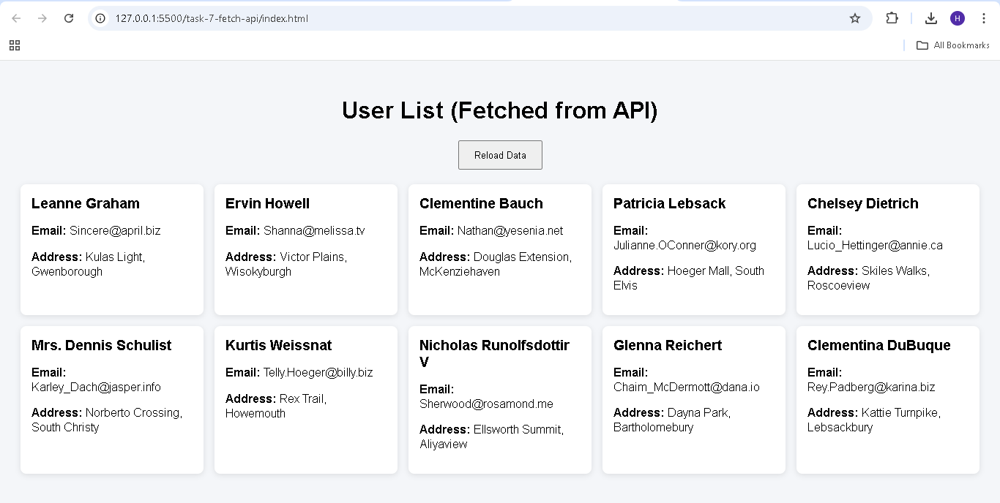
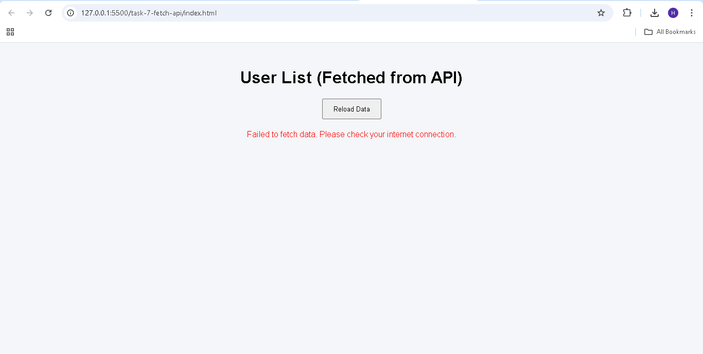

# Task 7 - Fetch API Project

## Objective
Fetch user data from a public API and display it using JavaScript Fetch API.

## Features
- Fetch API
- Async/Await
- Error Handling
- Reload Button
- Responsive UI

## Screenshots

### Successful Data Load

### Error Handling (Internet Disabled)

## API Used
https://jsonplaceholder.typicode.com/users